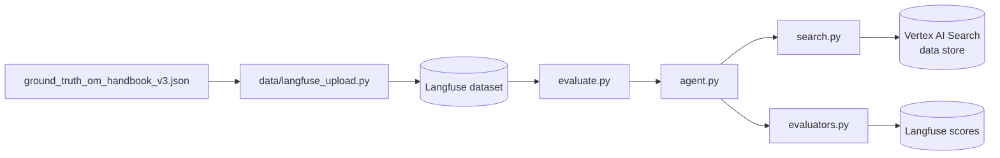

# Handbook QA

Grounded question-answering agent over the *Operations and Maintenance Handbook
for LP-Gas Bulk Storage Facilities* (built around NFPA 58 / NFPA 10 / NFPA 25
and related DOT regulations).

This is the capstone implementation described in the repo
[AGENTS.md](../../AGENTS.md). It mirrors the
[`knowledge_qa`](../knowledge_qa/README.md) baseline, but instead of grounding
on live web search it grounds every answer on a **Vertex AI Search data store**
built from the handbook PDF. Because the handbook is a safety-critical
procedures manual, **accuracy and traceability matter more than fluency**: a
confidently wrong or ungrounded answer is a failure, so the agent answers *only*
from retrieved content and cites the supporting source, preferring "not covered
in this handbook" over a plausible guess.

## Main components

| File | Role |
| --- | --- |
| [`search.py`](search.py) | The grounding tool. Calls the Discovery Engine `:search` REST endpoint directly in `CHUNKS` mode, returning each chunk's full text plus per-chunk metadata (`page`, `section_heading`, `document_id`, `chunk_id`) in a single call. Exposes `handbook_search` / `create_handbook_search_tool`. Auth prefers the attached GCE service account and falls back to Application Default Credentials. |
| [`agent.py`](agent.py) | The agent. A Google ADK ReAct agent (`PlanReActPlanner`) with the single `handbook_search` grounding tool. `HandbookGroundedAgent.answer_async` returns a `HandbookAgentResponse` carrying `text`, `safety_level`, `sources`, plus the `retrievals` and `trace` used by the LLM-judge evaluators. Enforces the grounding/refusal rules and appends a `SAFETY_LEVEL` harm-severity marker that is parsed back out. |
| [`evaluators.py`](evaluators.py) | Item-level graders. The three core axes (`answer_correctness`/`answer_similarity`, `safety_level_match`, `traceability_*`) plus an extended battery: heuristic (rule-based) checks, LLM-judge output checks, and LLM-judge trace checks. All are plain Langfuse evaluator callables that degrade gracefully when a judge is unavailable or an item is out of scope. |
| [`evaluate.py`](evaluate.py) | The offline experiment runner. Runs the agent over a Langfuse dataset, scores each answer with `evaluators.py`, and logs the scores to Langfuse for run-to-run comparison. |
| [`demo.py`](demo.py) | A local Gradio UI. Pick a ground-truth question, run the agent, and inspect the answer, classified safety level, and cited sources — scored with the same evaluators, but with no Langfuse round-trip. |
| [`data/langfuse_upload.py`](data/langfuse_upload.py) | Dataset uploader. Flattens each ground-truth item (per `evals/ground-truth/schema_v3.json`) into a Langfuse-compatible record (`input` / `expected_output` / `metadata`) and uploads it. |

## How the pieces fit together



## Prerequisites

- **Python 3.12+** with [`uv`](https://docs.astral.sh/uv/).
- A populated `.env` at the repo root (see [`.env.example`](../../.env.example)),
  including `VERTEX_AI_DATASTORE_ID`, `GOOGLE_CLOUD_LOCATION`, the Gemini API
  key, and Langfuse credentials.
- Google Cloud auth for the data store:
  `gcloud auth application-default login` (on a GCE/Coder workspace the attached
  service account is preferred automatically).
- The Vertex AI Search data store must exist. Build/refresh it from the repo
  root with:

  ```bash
  uv run python -m scripts.create_handbook_datastore \
      --bucket agentic-ai-evaluation-bootcamp-hitachi-rail \
      --datastore-id om-handbook-v1 \
      --input data/processed/om_handbook/chunks.jsonl
  ```

  Then copy the printed `VERTEX_AI_DATASTORE_ID` into `.env`.

## How to run

All commands are run **from the repo root** with `uv run --env-file .env`.

### 1. Upload the ground-truth dataset to Langfuse

```bash
uv run --env-file .env python -m implementations.handbook_qa.data.langfuse_upload
```

Defaults: `--ground-truth-path evals/ground-truth/ground_truth_om_handbook_v3.json`,
`--dataset-name OMHandbook-QA`. Override either flag to upload a different file
or dataset name.

### 2. Run the evaluation experiment

```bash
uv run --env-file .env python -m implementations.handbook_qa.evaluate \
    --dataset-name OMHandbook-QA \
    --experiment-name v1-baseline \
    --user-id "$USER"
```

Options: `--dataset-name` (default `OMHandbook-QA`), `--experiment-name`
(default auto-generated), `--user-id` (default current OS user),
`--max-concurrency` (default `1`). Scores are written back to Langfuse.

### 3. Explore interactively (local UI)

```bash
uv run --env-file .env python -m implementations.handbook_qa.demo
```

Launches a Gradio app (default port 7860). Add `--share` for a public link or
`--ground-truth-path <path>` to load a different dataset. Runs the agent and the
graders directly — no Langfuse round-trip.

## Evaluation axes

Grading follows [`evals/ground-truth/schema_v3.json`](../../evals/ground-truth/schema_v3.json):

1. **Answer correctness** — semantic similarity of the answer to the reference
   (`embedding_cosine`, threshold ~0.8), gated by `must_include` /
   `must_not_include` constraints.
2. **Safety level** — exact match of the agent's harm-severity classification
   (`negligible` → `low` → `moderate` → `high` → `critical`).
3. **Traceability** — recall of the *required* grounding sources the agent
   cited (`document_name`, `document_id`, `page`, `section_heading`, optional
   `chunk_id`). This is the core of grounded QA.

`evaluators.py` adds heuristic and LLM-judge metrics (relevance, completeness,
groundedness, refusal appropriateness, reasoning coherence, tool selection,
etc.) on top of these three axes.
